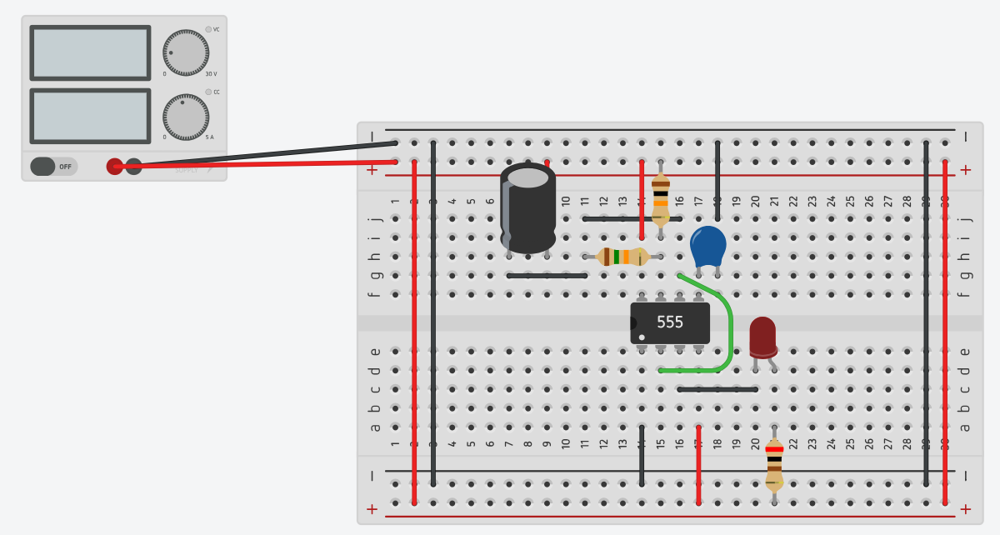
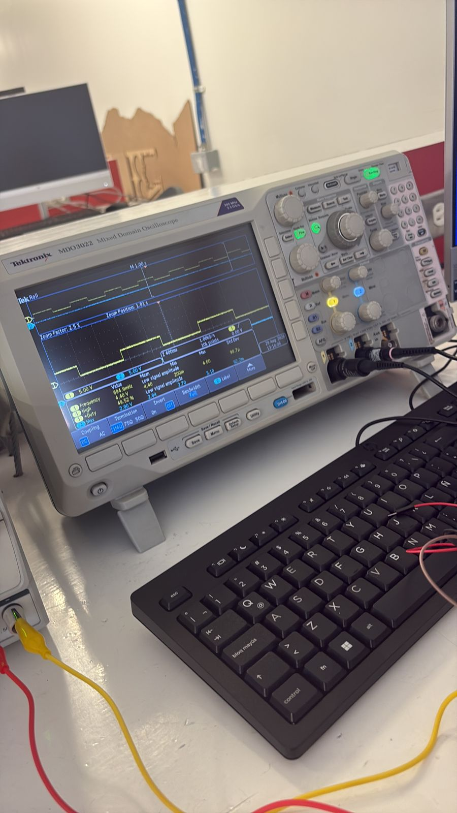
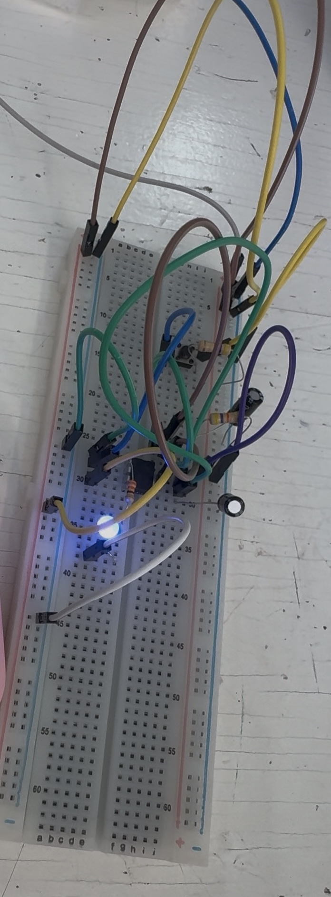

# Reporte de Práctica: Temporizador 555 en Modo Astable

## 1. Tabla de Medición vs. Teoría

Para el cálculo teórico de la corriente del LED ($I_{LED}$), se toma un voltaje directo del LED $V_f \approx 2.0\text{ V}$:

$$I_{LED (teórico)} = \frac{V_{out} - V_f}{R_{LED}} = \frac{3.5\text{ V} - 2.0\text{ V}}{330\ \Omega} \approx 4.55\text{ mA}$$

$$I_{LED (medido)} = \frac{2.9\text{ V} - 2.0\text{ V}}{330\ \Omega} \approx 2.73\text{ mA}$$

$$\% \text{ de Error} = \left| \frac{\text{Valor Teórico} - \text{Valor Medido}}{\text{Valor Teórico}} \right| \times 100$$

| Magnitud | Teórico (calculado) | Medido | % de error | ¿Con qué lo mediste? |
| :--- | :--- | :--- | :--- | :--- |
| **Vcc (V)** | $5.0\text{ V}$ | $5.01\text{ V}$ | $0.20\%$ | Multímetro (V, en paralelo) |
| **V de salida en ALTO (V)** | $3.5\text{ V}$ ($\approx Vcc - 1.5$) | $2.90\text{ V}$ | $17.14\%$ | Osciloscopio / Multímetro |
| **Frecuencia (Hz)** | $0.69\text{ Hz}$ | $0.685\text{ Hz}$ ($684.9\text{ mHz}$) | $0.72\%$ | Osciloscopio (Measure) |
| **Duty (%)** | $52.40\%$ | $49.53\%$ | $5.48\%$ | Osciloscopio (Measure) |
| **I del LED (mA)** | $4.55\text{ mA}$ | $3.8\text{ mA}$ | $16.48\%$ | Multímetro (A, en serie) / Calculado con $V_{out}$ medido |

---

## 2. Análisis del Error: ¿Por qué no dio exacto?

El componente que **domina el error** en la temporización del circuito es el **capacitor electrolítico de $100\ \mu\text{F}$**.

* **Tolerancia del capacitor:** Los capacitores electrolíticos tienen una tolerancia muy amplia (típicamente entre $-20\%$ y $+80\%$). Una ligera variación respecto al valor nominal de $100\ \mu\text{F}$ altera directamente las constantes de tiempo de carga ($t_{ALTO}$) y descarga ($t_{BAJO}$), desviando la frecuencia teórica y el ciclo de trabajo (*duty cycle*).
* **Tolerancia de resistores:** Las resistencias de película de carbón comerciales tienen una tolerancia de solo $\pm 5\%$, por lo que su contribución al porcentaje de error global es considerablemente menor comparada con la del capacitor.
* **Caída de voltaje en la salida del 555:** La etapa de salida interna del transistor bipolar del NE555 presenta una caída de tensión en estado ALTO. Aunque en teoría se aproxima como $Vcc - 1.5\text{ V}$ ($3.5\text{ V}$), en la medición real se registraron $2.90\text{ V}$ debido a la carga que demanda el LED y la resistencia limitadora, lo que explica la diferencia en la corriente calculada.

---

## 3. Bitácora de Errores

### Error 1: Polarización del LED
* **Qué falló:** Al alimentar la protoboard con los $5\text{ V}$ regulados, el LED no parpadeaba ni emitía luz.
* **Cómo se encontró:** Se comprobó con el osciloscopio que la patilla 3 de salida del NE555 sí estaba entregando la onda cuadrada esperada. Al inspeccionar físicamente el componente, se identificó que las terminales del LED (ánodo y cátodo) estaban invertidas.
* **Cómo se resolvió:** Se rotó el LED $180^\circ$ en la protoboard, conectando correctamente el ánodo al nodo de la resistencia de $330\ \Omega$ (proveniente del pin 3) y el cátodo a la línea de tierra ($GND$).

### Error 2: Colocación Errónea de las Resistencias Temporizadoras ($R_A$ y $R_B$)
* **Qué falló:** El circuito no oscilaba al inicio debido a una conexión errónea de nodos entre las resistencias temporizadoras y el integrado.
* **Cómo se encontró:** Se siguió el diagrama esquemático línea por línea con el multímetro en modo continuidad. Se observó que el puente entre el pin 2 (*TRIGGER*) y el pin 6 (*THRESHOLD*) no estaba conectado al nodo común entre $R_B$ y el capacitor $C$.
* **Cómo se resolvió:** Se reubicaron los terminales en la protoboard de modo que $R_A$ ($1\text{ k}\Omega$) quedara entre $Vcc$ y el pin 7 (*DISCHARGE*), $R_B$ ($10\text{ k}\Omega$) entre el pin 7 y la unión de los pines 2 y 6, y el capacitor de $100\ \mu\text{F}$ entre ese mismo nodo y tierra.


---

## 6. Práctica de Circuito Oscilador con Temporizador NE555

### 6.1. Diagrama Esquemático y Ensamble en Protoboard

En esta sección se llevó a cabo el diseño, simulación y armado físico de un circuito astable utilizando el circuito integrado **NE555**, orientado a la generación de señales de pulso cuadradas y el control de parpadeo de una carga (LED).

* **Simulación / Esquema:** Se diseñó el circuito definiendo la red RC (resistencia-capacitancia) para establecer la frecuencia de oscilación deseada.
* **Implementación Física:** Se trasladó la conexión al protoboard utilizando capacitores electrolíticos, cerámicos, resistencias de precisión, LED indicador y cables de puenteo (*jumpers*).


*Figura 6: Diagrama y simulación de la conexión del temporizador NE555 alimentado por la fuente de voltaje.*


*Figura 7: Implementación física del circuito en protoboard, mostrando el arreglo de componentes y cableado de alimentación.*

---

###  Medición y Análisis de Señal con Osciloscopio (Tektronix MDO3022)

Para caracterizar el comportamiento del circuito, se conectó la salida del temporizador a la punta de prueba del Canal 1 de un osciloscopio **Tektronix MDO3022 Mixed Domain Oscilloscope**.

1. **Conexión de Mediciones:**
   * La punta del osciloscopio se conectó a la señal de salida del NE555 (Canal 1), asegurando la toma de tierra al negativo común de la fuente de poder de 5 V.
2. **Parámetros Medidos:**
   * **Frecuencia ($f$):** $\approx 594.9\text{ mHz}$ (período de oscilación amplio visible en el parpadeo del LED).
   * **Período ($T$):** $\approx 1.681\text{ s}$.
   * **Ciclo de Trabajo (+Duty):** $\approx 48.7\%$, confirmando una onda cuadrada casi simétrica de encendido y apagado.


*Figura 8: Lectura del osciloscopio Tektronix registrando la señal continua y los parámetros de frecuencia y ciclo de trabajo.*

---

###  Video de Demostración del Funcionamiento

A continuación se muestra el comportamiento dinámico del circuito en tiempo real, observando la sincronización entre la onda cuadrada en la pantalla del osciloscopio y el parpadeo constante del LED en la protoboard:

[](../imVS/VidOscilos.mp4)

*Figura 9: Haz clic en la imagen superior para reproducir el video de la práctica (`VidOscilos.mp4`), o utiliza la reproducción directa si exportas a HTML:*

```html
<video src="../imVS/VidOscilos.mp4" controls width="100%"></video>


# Actividad de Punto Extra: Temporizador 555 en Modo Monoestable

## 1. Tabla de Medición vs. Teoría

Para el cálculo teórico del tiempo de pulso ($t_{pulso}$), se utiliza la resistencia comercial disponible $R = 47\text{ k}\Omega$ ($47,000\ \Omega$) y el capacitor electrolítico de $C = 100\ \mu\text{F}$ ($100 \times 10^{-6}\text{ F}$):

$$t_{pulso (teórico)} = 1.1 \cdot R \cdot C = 1.1 \times 47,000\ \Omega \times (100 \times 10^{-6}\text{ F}) = 5.17\text{ s}$$

$$\% \text{ de Error} = \left| \frac{t_{teórico} - t_{medido}}{t_{teórico}} \right| \times 100 = \left| \frac{5.17\text{ s} - 5.0\text{ s}}{5.17\text{ s}} \right| \times 100 \approx 3.29\%$$

| Magnitud | Teórico (calculado) | Medido (cronómetro / osciloscopio) | % de error |
| :--- | :--- | :--- | :--- |
| **Duración del pulso (s)** | $5.17\text{ s}$ | $5.00\text{ s}$ | $3.29\%$ |

> **Nota:** La tabla de la práctica mostraba un tiempo teórico sugerido de $1.1\text{ s}$ (pensado para $R = 100\text{ k}\Omega$ y $C = 10\ \mu\text{F}$). Al ajustar la fórmula con los componentes reales del laboratorio ($R = 47\text{ k}\Omega$ y $C = 100\ \mu\text{F}$), el valor teórico exacto da $5.17\text{ s}$.

---

## 2. Explicación de la Duración del Pulso y Variaciones

La duración del pulso en un circuito monoestable depende directamente de la constante de tiempo $RC$ para alcanzar el umbral de disparo interno del 555 ($\frac{2}{3}Vcc$):

* **Cambio de componentes respecto al ejemplo de la guía:** Al sustituir los valores base ($100\text{ k}\Omega$ y $10\ \mu\text{F}$) por los componentes disponibles ($47\text{ k}\Omega$ y $100\ \mu\text{F}$), el producto $R \cdot C$ incrementó considerablemente. El capacitor de $100\ \mu\text{F}$ retiene diez veces más carga que uno de $10\ \mu\text{F}$, lo que extiende el tiempo necesario para cargarse hasta $\frac{2}{3}Vcc$ y aumenta la duración del pulso a poco más de $5$ segundos.
* **Causa del margen de error ($3.29\%$):**
  * **Tolerancia del capacitor electrolítico:** Típicamente varía entre un $-20\%$ y un $+80\%$. Una pequeña desviación a la baja en la capacitancia real del componente reduce ligeramente el tiempo de carga efectivo de $5.17\text{ s}$ a los $5.00\text{ s}$ medidos.
  * **Tolerancia de la resistencia:** La resistencia de $47\text{ k}\Omega$ cuenta con una tolerancia de $\pm 5\%$.
  * **Tiempo de reacción humano:** Al utilizar un cronómetro manual para medir la salida luminosa del LED, existe un tiempo de reacción inherente al presionar el botón al inicio y al apagado del diodo.


## 3. Evidencia Fotográfica y Demostración en Video

### Montaje Físico en Protoboard


* **Descripción:** Montaje del circuito temporizador monoestable utilizando el CI NE555, resistencia temporizadora de $47\text{ k}\Omega$, capacitor de $100\ \mu\text{F}$, botón pulsador (*push button*) para el disparo en el pin 2 y LED indicador azul con su resistencia limitadora en la salida (pin 3).

---

### Evidencia del Pulso Temporizado (Video de Medición)
* **Archivo de Video:** `Video punto extra.mp4` (o enlace correspondiente a tu portafolio/drive).
* **Duración total:** $7\text{ segundos}$.

[](../imVS/Videopuntoextra1.mp4)

* **Descripción de la prueba:**
  * **00:00 - 00:01:** Estado inicial en reposo. El cronómetro digital se encuentra en `00:00.00` y el LED permanece apagado en nivel BAJO ($0\text{ V}$).
  * **00:02:** Se presiona el botón de disparo (*trigger*). El LED azul se enciende inmediatamente al pasar la salida al nivel ALTO y se inicia el conteo.
  * **00:02 - 00:05:** El capacitor de $100\ \mu\text{F}$ se carga progresivamente a través de la resistencia de $47\text{ k}\Omega$. El LED se mantiene encendido.
  * **00:05.71:** El voltaje del capacitor alcanza los $\frac{2}{3}Vcc$, conmutando la salida a nivel BAJO. El LED se apaga completamente, registrando una duración efectiva del pulso de $5.00\text{ segundos}$ en el cronómetro.

//Se usó Claude para la elaboracion del codigo en Visual Studio y formato de la practica//