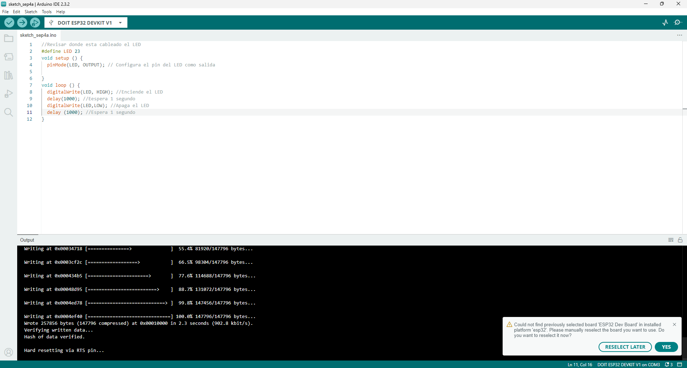
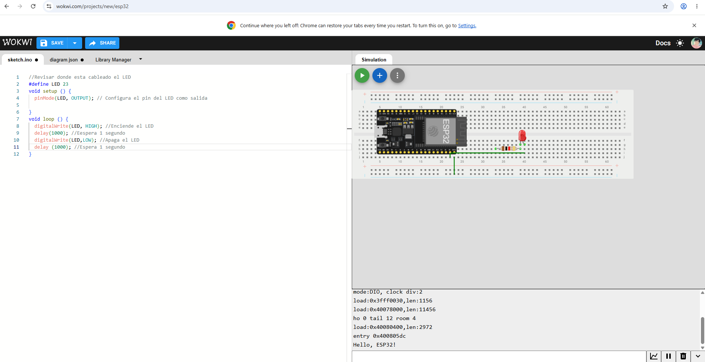
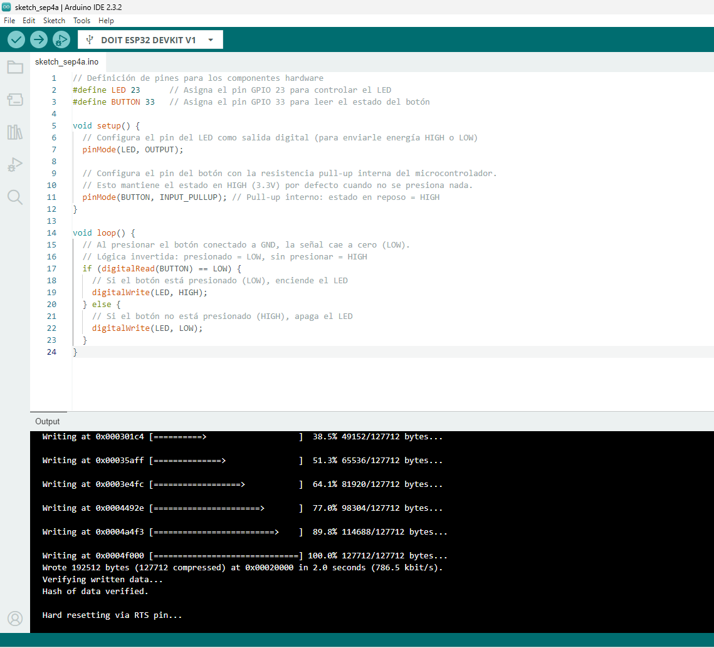
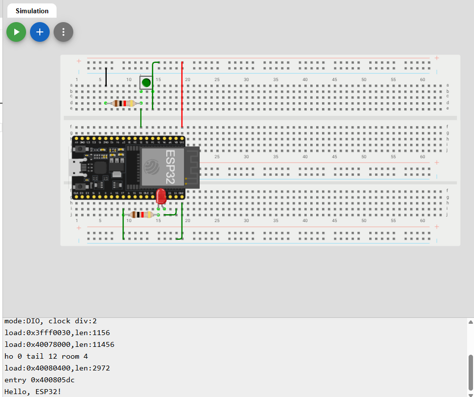
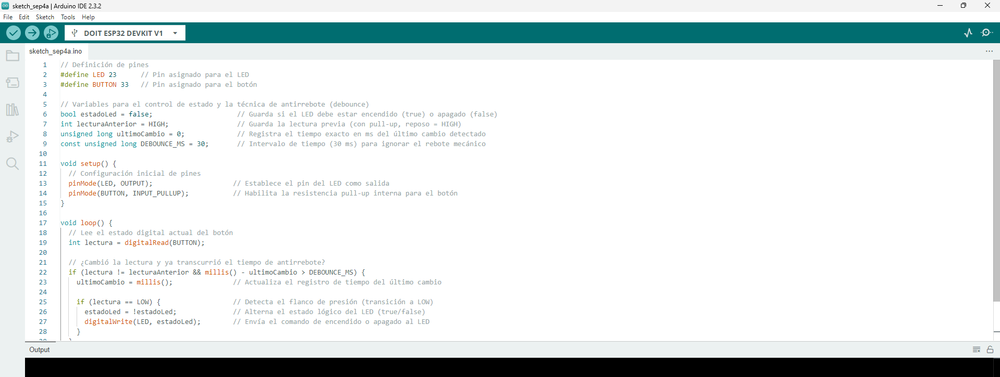
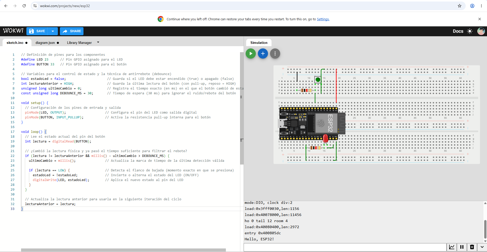
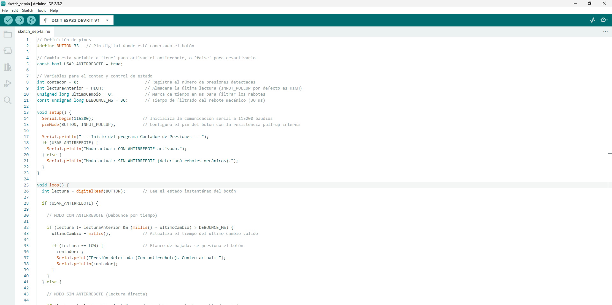
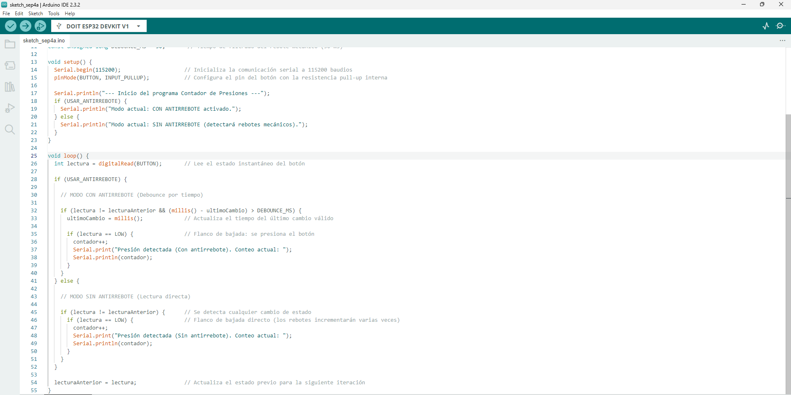

# Reporte de Práctica: ESP32 - Salida, Entrada & Antirrebote

## 1. Códigos e Implementación en el IDE

### Programa 1: BLINK (Salida Digital)

---

### Programa 2: BLINK con Botón (Entrada Digital)

---

### Programa 3: TOGGLE con Antirrebote (Sin delay)

---

### Programa Extra: Contador con y sin Antirrebote

---

## 2. Esquemáticos y Montaje

* **Asignación de Pines (GPIOs):**
  * **LED:** Conectado al **GPIO23** a través de una resistencia limitadora de $220\ \Omega$ hacia tierra ($GND$).
  * **Botón:** Conectado entre el **GPIO33** y $GND$ para operar utilizando la resistencia interna `INPUT_PULLUP`.

---

## 3. Explicación Teórica

### a. ¿Qué es el rebote de un botón?
El rebote (*bounce*) es un fenómeno mecánico inevitable. Al presionar o soltar un interruptor o botón físico, las láminas metálicas internas no efectúan un contacto limpio e instantáneo, sino que chocan y vibran microscópicamente durante varios milisegundos (típicamente entre $1\text{ ms}$ y $30\text{ ms}$). Debido a que el microcontrolador ESP32 opera a altas frecuencias de procesamiento, interpreta este ruido de conmutación como múltiples pulsaciones consecutivas muy rápidas en lugar de una sola acción del usuario.

### b. ¿Por qué con `INPUT_PULLUP` la lógica queda invertida?
Al definir el pin mediante `INPUT_PULLUP`, se activa internamente una resistencia conectada directamente a la línea de alimentación de $3.3\text{ V}$.
* **Estado en reposo (sin presionar):** La resistencia fija la entrada en un voltaje alto, haciendo que `digitalRead()` devuelva el valor `HIGH` ($1$).
* **Estado activo (presionado):** Al presionar el botón, la señal se deriva directamente a $GND$ ($0\text{ V}$), provocando que `digitalRead()` devuelva el valor `LOW` ($0$).

De este modo, la lógica de lectura resulta invertida con respecto al estado físico del pulsador (reposo = `HIGH`, presionado = `LOW`).

---

## 4. Reporte de Fallas y Conclusiones

### Bitácora de Errores
* **Síntoma / Fallo:** Al intentar compilar y transferir el programa a la tarjeta ESP32 DevKit V1 desde el entorno de desarrollo, el sistema arrojaba una falla indicando que no encontraba la plataforma seleccionada (`Could not find previously selected board 'ESP32 Dev Board'`) y no detectaba el puerto de comunicación.
* **Cómo se encontró:** Se observó la notificación de error en la barra inferior del IDE y se comprobó que el menú desplegable de selección de puertos no reconocía ningún puerto COM activo asignado a la tarjeta.
* **Solución:** 1. Se agregó el enlace oficial del gestor de tarjetas ESP32 en las preferencias del entorno (`https://espressif.github.io/arduino-esp32/package_esp32_index.json`).
  2. Se abrió el gestor de tarjetas (*Board Manager*), se buscó el paquete **esp32** de Espressif y se completó su instalación.
  3. Se seleccionó la tarjeta **DOIT ESP32 DEVKIT V1** y el puerto COM asignado, permitiendo realizar la compilación y subida del programa de forma satisfactoria.

### Conclusión
Durante el desarrollo de la práctica se comprendió la configuración y manipulación de entradas y salidas digitales en la plataforma ESP32. Se verificó la eficiencia de activar la resistencia interna `INPUT_PULLUP` para simplificar las conexiones eléctricas en la protoboard, así como la efectividad de implementar algoritmos de filtrado por software mediante la función `millis()` para eliminar falsos disparos por rebotes mecánicos en lecturas digitales.