# Reporte de Práctica: Maquinaria, Herramientas e Instrumentos de Medición

**Institución:** Universidad Iberoamericana Puebla  
**Lugar:** Instituto de Diseño e Innovación Tecnológica (IDIT)  
**Asignatura:** Proyecto de Ingeniería  
**Profesor:** Oliver  

---

## 1. Normas Generales de Seguridad e Higiene en el Taller

El trabajo dentro de los talleres de manufactura del IDIT exige el cumplimiento estricto de las normas de seguridad e higiene para prevenir accidentes operativos y garantizar un entorno de trabajo controlado.

### Equipo de Protección Personal (EPP) Requerido:
*   **Bata de laboratorio / taller:** De uso obligatorio y debidamente abotonada para evitar atrapamientos en partes móviles de las máquinas.
*   **Botas de seguridad:** Indispensables para la protección de las extremidades inferiores ante la caída accidental de piezas pesadas, láminas metálicas o herramientas.
*   **Lentes de seguridad:** De uso estricto y obligatorio al operar o estar cerca de maquinaria de corte y maquinado (como la fresadora o la sierra de cinta) para proteger los ojos de la proyección de virutas, astillas o partículas incandescentes.

---

## 2. Metrología e Instrumentos de Medición

Durante la sesión impartida por el profesor Oliver, se revisaron detalladamente herramientas de medición de alta precisión utilizadas en ingeniería, comparando instrumentos analógicos y digitales.

### 2.1. Calibrador Vernier (Pie de Rey)
El vernier es una herramienta versátil que permite tomar tres lecturas fundamentales:
1.  **Medición exterior:** Se efectúa mediante las mordazas inferiores para determinar diámetros o grosores externos.
2.  **Medición interior:** Se realiza con las orejetas superiores para medir diámetros internos, aberturas o ranuras.
3.  **Medición de profundidad:** Se ejecuta mediante la varilla o vástago extensible del extremo posterior.

*   **Uso del Vernier Mecánico vs. Digital:** El vernier mecánico (analógico) requiere la lectura de la escala principal y la identificación del trazo coincidente en el nonio. Por su parte, el vernier digital brinda una lectura directa en pantalla LCD y facilita la conversión rápida de unidades entre milímetros y pulgadas.

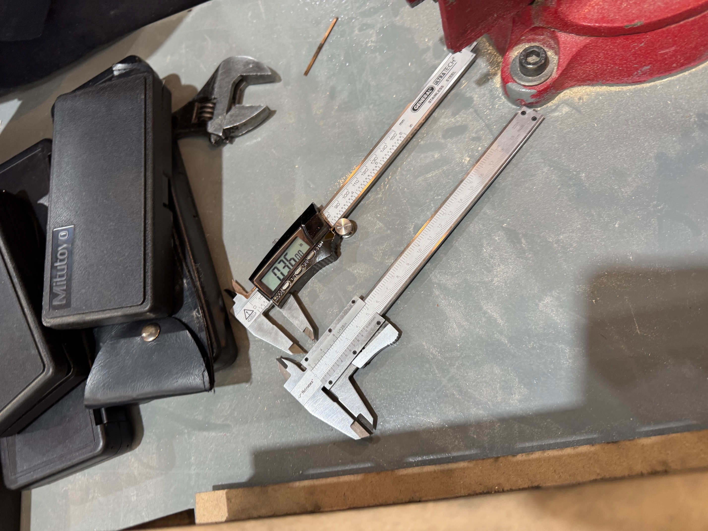  
*Figura 1: Comparativa entre un calibrador vernier analógico (izquierda) y un calibrador vernier digital (derecha) en el taller del IDIT.*

---

### 2.2. Micrómetro (Pálmer)
Ofrece una precisión superior a la del vernier, siendo idóneo para medir espesores delgados y diámetros reducidos con alta fidelidad.

*   **Micrómetro Mecánico:** La medición se determina sumando la escala graduada del tambor fijo con la división del tambor móvil.
*   **Micrómetro Digital y Función INC (Incremental):** El modelo digital permite lecturas absolutas e incorpora la función **INC**. Al presionar el botón INC, la pantalla se establece en cero ($0.000\text{ mm}$) en cualquier posición, facilitando mediciones relativas, verificación de tolerancias y diferencias respecto a una pieza patrón.

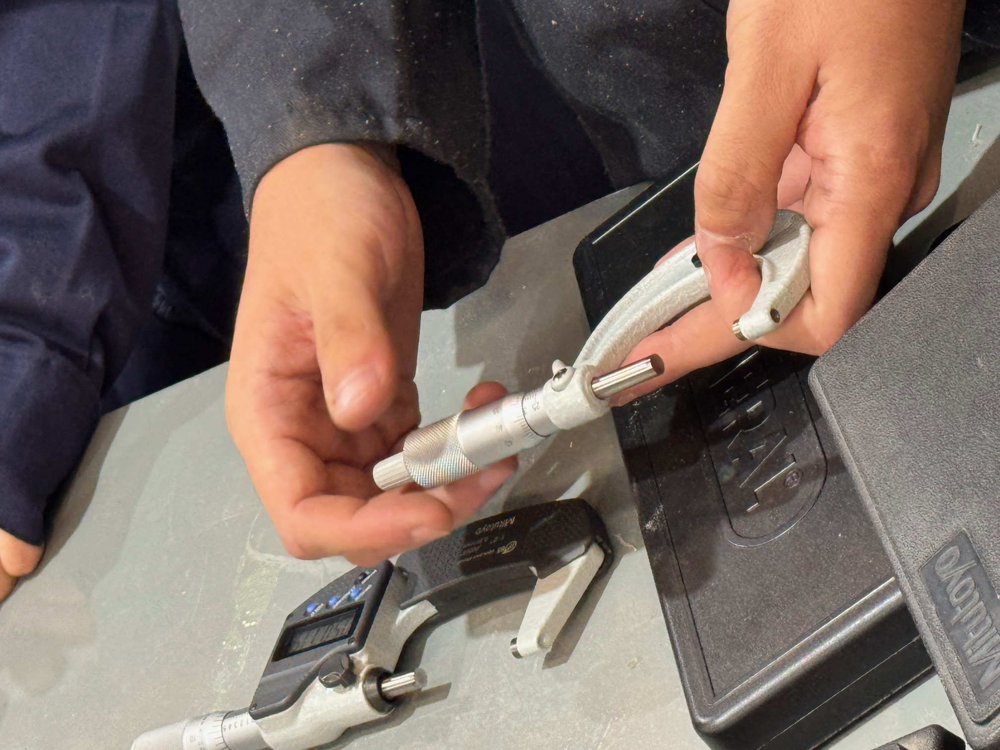

*Figura 2: Demostración de lectura y manipulación de micrómetro mecánico y digital en la mesa de trabajo.*

### 2.3. Registro Experimental de Mediciones en Cubos de Prueba

Durante la práctica se tomaron lecturas dimensionales de 5 cubos de prueba (identificados como Cubos 3, 8, 10, 11 y 12), evaluando el ancho ($a$), largo ($l$) y alto ($h$) mediante el uso consecutivo del micrómetro y del calibrador vernier.

#### Mediciones con Micrómetro (Resolución en milésimas de milímetro, $\text{mm}$)

| Identificador de Cubo | Ancho ($a$) | Largo ($l$) | Alto ($h$) |
| :--- | :--- | :--- | :--- |
| **Cubo 3** | $26.623\text{ mm}$ | $34.520\text{ mm}$ | $22.528\text{ mm}$ |
| **Cubo 8** | $29.792\text{ mm}$ | $43.448\text{ mm}$ | $29.868\text{ mm}$ |
| **Cubo 10** | $38.865\text{ mm}$ | $38.834\text{ mm}$ | *Excede la capacidad de apertura del micrómetro* |
| **Cubo 11** | $31.277\text{ mm}$ | $27.156\text{ mm}$ | $28.459\text{ mm}$ |
| **Cubo 12** | $29.209\text{ mm}$ | $33.839\text{ mm}$ | $26.892\text{ mm}$ |

#### Mediciones con Calibrador Vernier (Resolución en centésimas de milímetro, $\text{mm}$)

| Identificador de Cubo | Ancho ($a$) | Largo ($l$) | Alto ($h$) |
| :--- | :--- | :--- | :--- |
| **Cubo 3** | $28.38\text{ mm}$ | $36.98\text{ mm}$ | $24.12\text{ mm}$ |
| **Cubo 8** | $31.51\text{ mm}$ | $45.14\text{ mm}$ | $32.55\text{ mm}$ |
| **Cubo 10** | $40.81\text{ mm}$ | $40.48\text{ mm}$ | $19.33\text{ mm}$ |
| **Cubo 11** | $33.01\text{ mm}$ | $28.80\text{ mm}$ | $30.24\text{ mm}$ |
| **Cubo 12** | $30.90\text{ mm}$ | $35.54\text{ mm}$ | $28.89\text{ mm}$ |

#### Observaciones Metrológicas:
1. **Límite de Rango:** Para la dimensión $h$ del Cubo 10, la apertura del arco del micrómetro utilizado resultó insuficiente para abrazar la pieza, evidenciando una limitación operativa en el rango de alcance del micrómetro frente a la versatilidad de apertura del vernier.
2. **Diferencia de Resolución:** Las lecturas del micrómetro aportan tres decimales de precisión ($\pm 0.001\text{ mm}$), mientras que el vernier registra hasta dos decimales ($\pm 0.01\text{ mm}$), adecuado para inspecciones dimensionales rápidas.

.JPG)

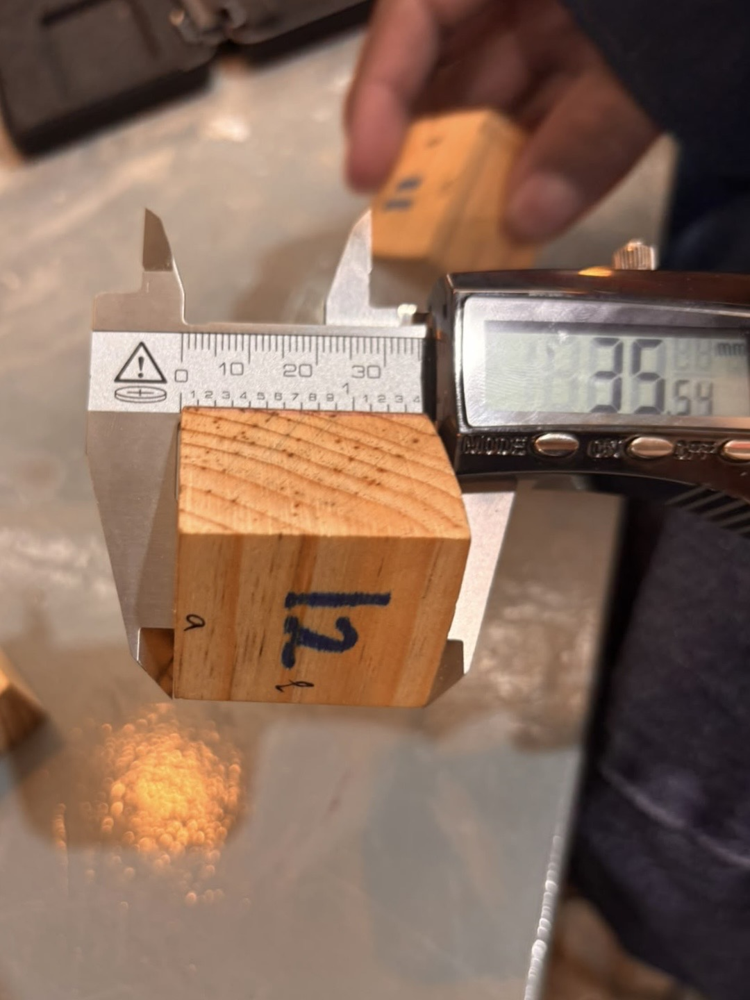
---

## 3. Maquinaria de Corte y Maquinado

### 3.1. Fresadora e Instrumentos de Corte

#### Diferencia Fundamental entre Fresa y Broca:
*   **Broca:** Diseñada únicamente para penetrar en dirección axial (eje $Z$), realizando barrenos o perforaciones cilíndricas.
*   **Fresa:** Diseñada con filos helicoidales tanto frontales como laterales, lo que le permite cortar en dirección axial y transversal ($X$, $Y$). Sirve para el desbaste, planeado, ranurado y perfilado de piezas.

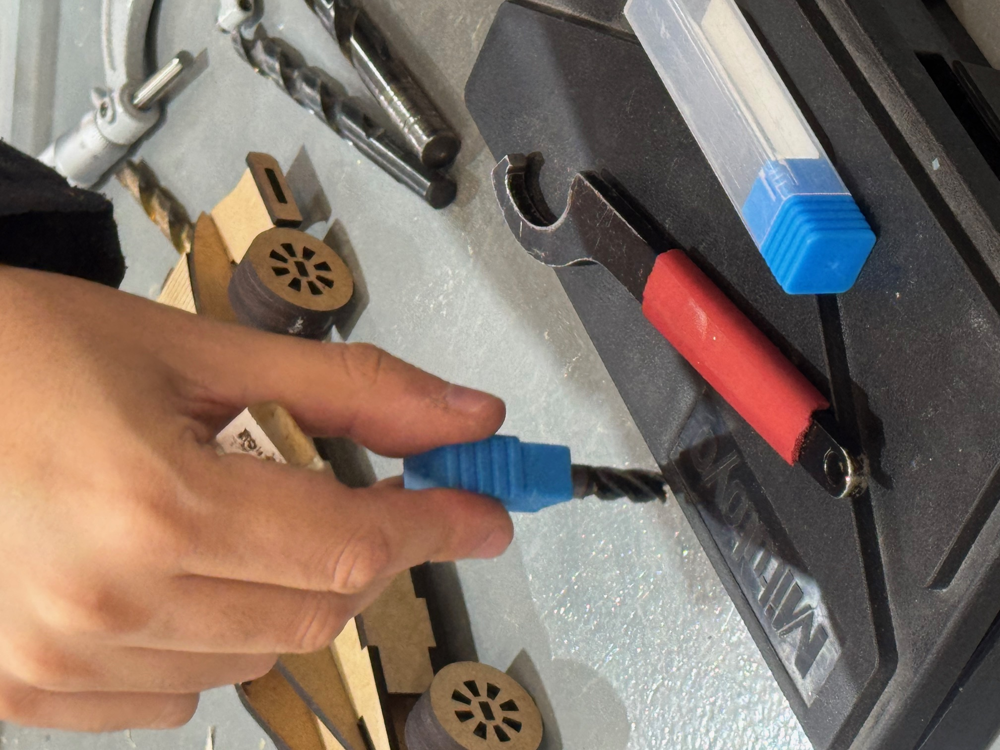  
*Figura 3: Inspección visual de una fresa de corte helicoidal y brocas de perforación.*

#### Reglas de Operación y Parámetros Técnicos en el Fresado:
1.  **Regla de Empape / Contacto:** Al realizar un corte lateral o de desbaste, **el material no debe abarcar más de la mitad del diámetro de la fresa**. Exceder este límite sobrecarga los filos y causa deflexión o rotura de la herramienta.
2.  **Ajuste de Velocidades según el Material:** La velocidad de giro ($RPM$) debe ajustarse según el tipo de material a trabajar (madera vs. metales blando o duro).
3.  **Control de Fricción y Temperatura:** Una velocidad inadecuada o un avance forzado generan fricción excesiva. Esto provoca un sobrecalentamiento drástico que llega a quemar tanto la herramienta de corte como la pieza de trabajo.
4.  **Movimiento de la Mesa mediante Manivelas:** El posicionamiento preciso de la pieza se controla manualmente accionando las manivelas de los carros longitudinal ($X$), transversal ($Y$) y vertical ($Z$).

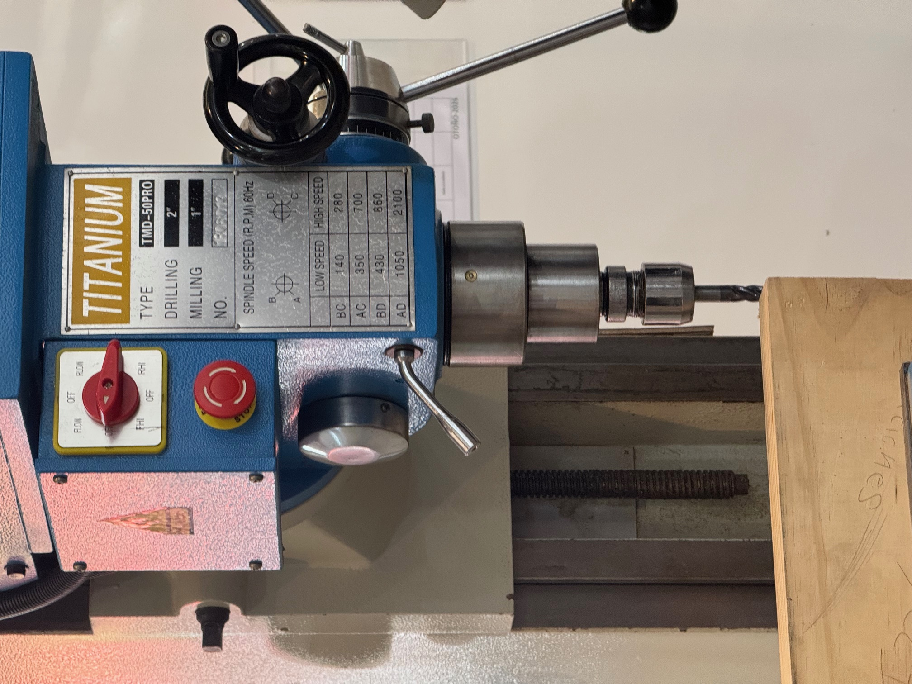  
*Figura 4: Cabezal y panel de ajuste de velocidad de giro (RPM) de la fresadora Titanium TMD-50PRO.*

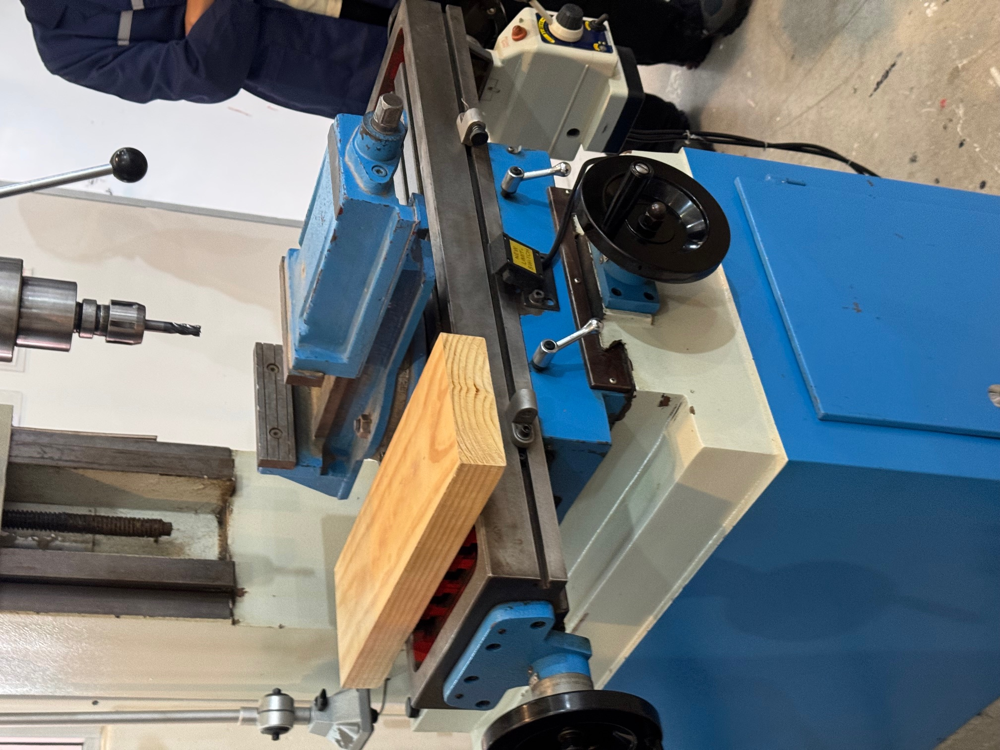  
*Figura 5: Mesa de trabajo de la fresadora equipada con prensa de sujeción, pieza de madera de prueba y manivelas de posicionamiento.*

---

### 3.2. Sierra de Cinta para Madera

Esta máquina utiliza una hoja de sierra sin fin accionada por poleas para efectuar cortes continuos rectos y curvos en madera y tableros derivados.

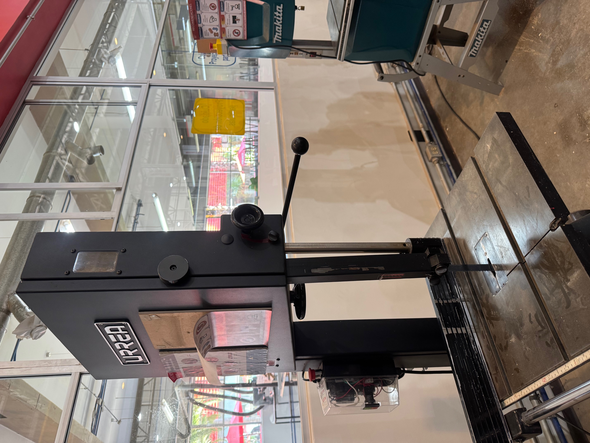  
*Figura 6: Sierra de cinta de banco de la marca Urrea para cortes contorneados en madera.*

---

## 4. Deformación y Corte de Lámina Metálica

### 4.1. Guillotina Mecánica Manual para Lámina
Diseñada para realizar cortes rectos y limpios en láminas metálicas de calibres delgados e intermedios.

*   **Técnica Correcta y Seguridad en el Pedal:** La máquina funciona mediante una palanca de pedal inferior. Para accionarla de forma segura, **se debe accionar el pedal apoyando un solo pie, manteniendo la otra pierna bien cimentada en el suelo**. **Jamás se debe subir con ambos pies al pedal**, ya que se pierde el equilibrio, generando un grave riesgo de caída y lesión corporal.

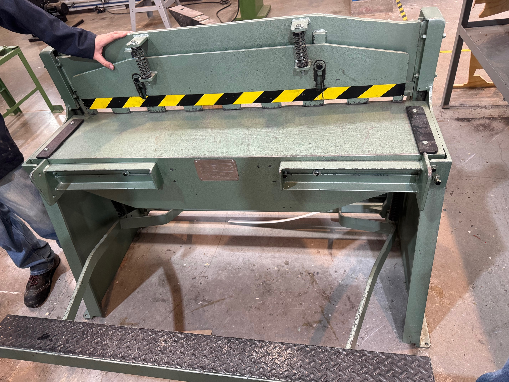  
*Figura 7: Guillotina mecánica manual para lámina metálica en el taller de metales.*

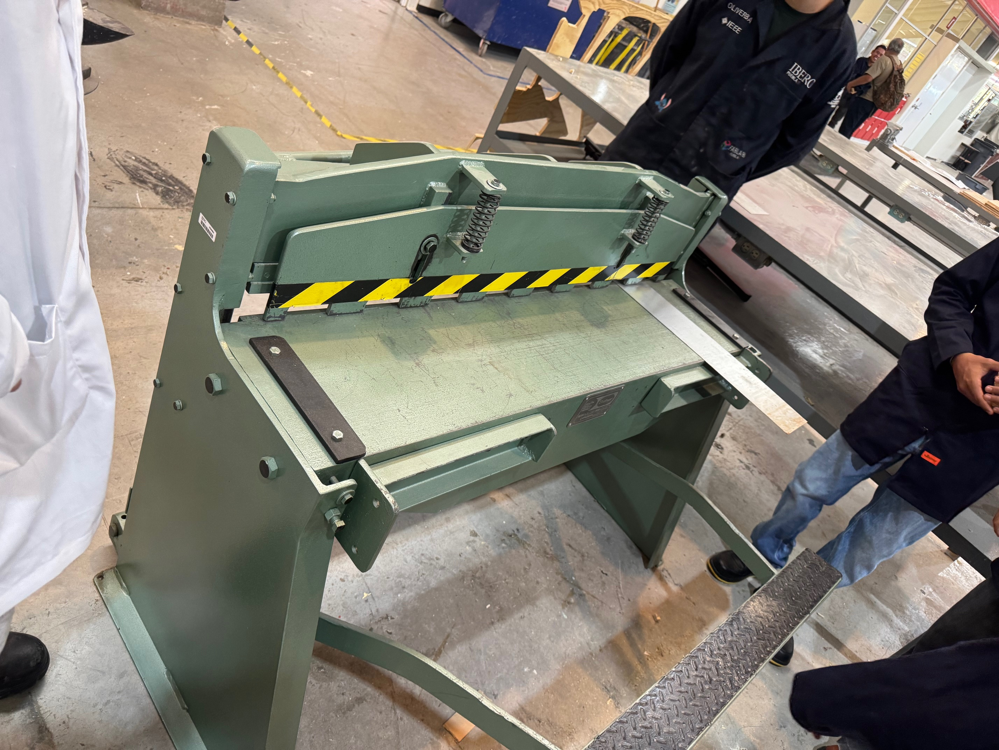  
*Figura 8: Demostración del accionamiento del pedal de la guillotina aplicando fuerza únicamente con un pie.*

---

### 4.2. Dobladora de Lámina (Prensa de Doblado)
Utilizada para efectuar pliegues, pestañas y dobleces angulares en láminas metálicas. Funciona aplicando una fuerza uniforme mediante una cortina/regla superior sobre una matriz inferior.

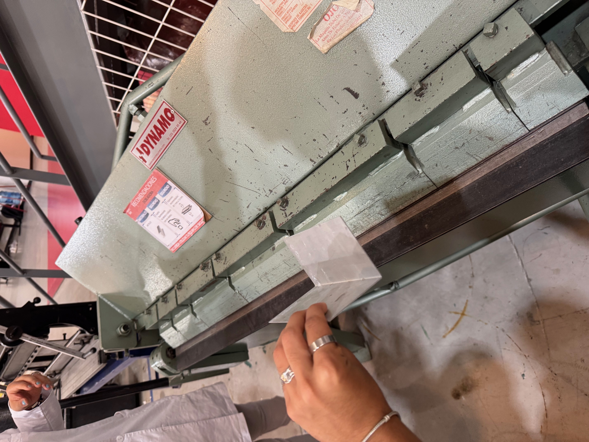  
*Figura 9: Proceso de verficación del ángulo de doblado en una muestra de lámina procesada en la dobladora Dynamo.*

---

## 5. Procesos de Unión: Soldadora por Puntos

La soldadora por puntos (soldadura por resistencia eléctrica) une dos láminas de metal superpuestas sin requerir material de aporte. Aplica presión mecánica concentrada a través de dos electrodos de cobre e introduce un pulso de corriente eléctrica de gran intensidad en una fracción de segundo, logrando la fusión local del metal.

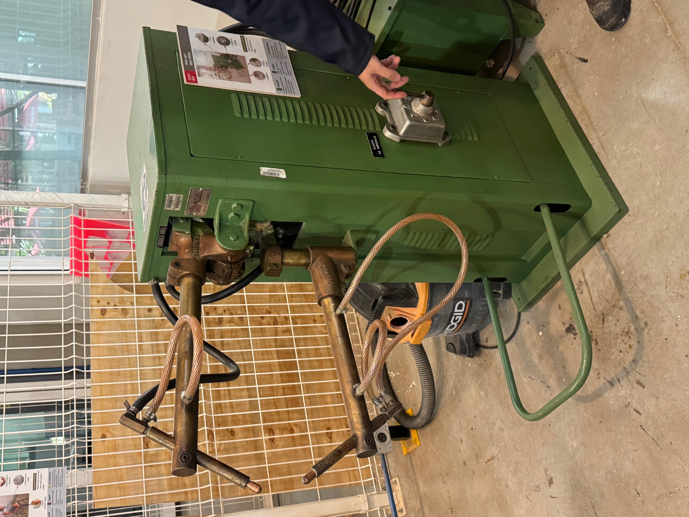  
*Figura 10: Equipo de soldadura por puntos por resistencia con electrodos de cobre y selector de amperaje.*

---

## 6. Conclusión
La práctica presencial en las instalaciones del IDIT de la Ibero Puebla, guiada por el profesor Oliver, reforzó de manera práctica los conceptos fundamentales del procesamiento de materiales y metrología. La correcta interpretación de las lecturas en instrumentos de medición analógicos y digitales, el conocimiento de los límites operativos de las herramientas de corte (como el área de empape en fresado y la gestión del calor por fricción), así como la estricta adherencia a las normas de seguridad (EPP y posturas seguras en guillotinas), garantizan una formación técnica sólida para el desarrollo seguro y eficiente de proyectos de ingeniería.