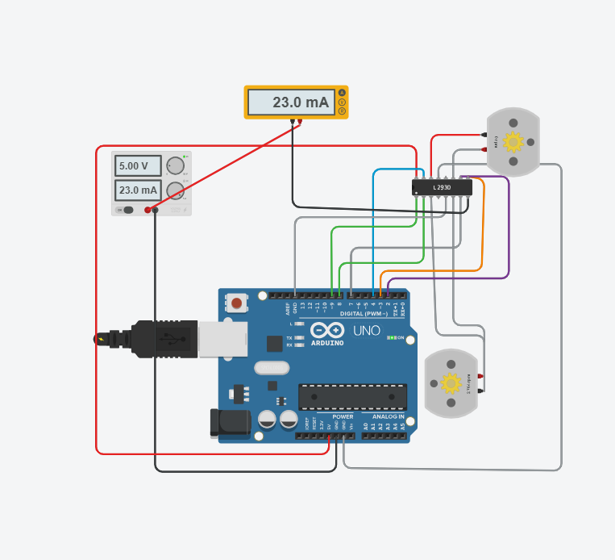
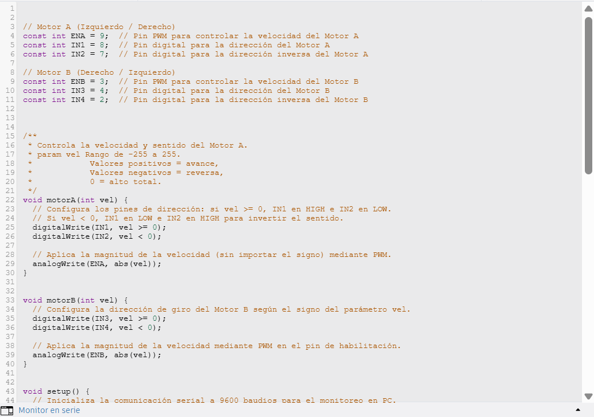
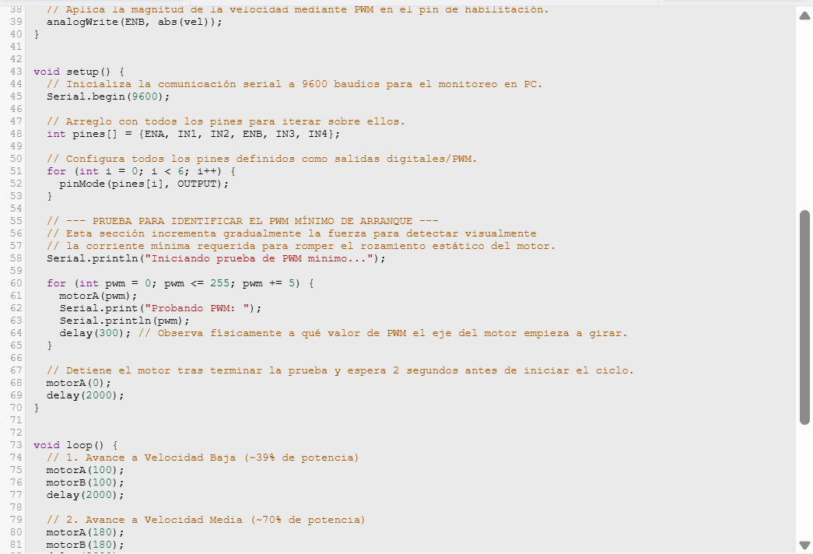
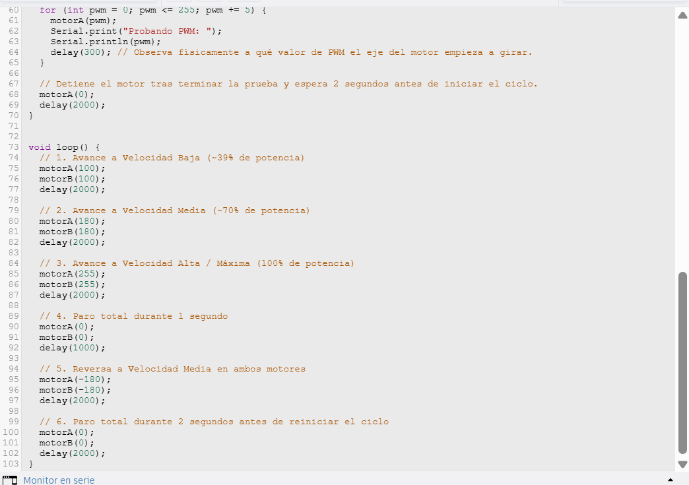

# Reporte de Práctica: Motor DC, Puente H & Servomotores

## 1. Objetivos

* **Control de Dirección y Velocidad (Motor DC):**
  * Controlar el giro del motor DC en ambos sentidos mediante pines lógicos (`IN1`/`IN2` e `IN3`/`IN4`).
  * Implementar control de velocidad utilizando modulación por ancho de pulso (PWM) con al menos 3 velocidades distintas.
  * Identificar experimentalmente el valor de PWM mínimo requerido para el arranque del motor.
* **Prueba de Carga y Medición de Corriente:**
  * Medir el consumo de corriente durante el arranque y en estado de giro libre intercalando un multímetro en serie.
  * Comparar ambos valores de corriente y justificar teóricamente cuál es mayor y por qué.
* **Control de Servomotores:**
  * Demostrar el posicionamiento angular de dos servomotores a $0^\circ$, $90^\circ$ y $180^\circ$.
  * Explicar y calcular el ciclo de trabajo (*Duty Cycle*) de la señal PWM para cada una de las posiciones angulares.

---

## 2. Materiales Utilizados

* Microcontrolador Arduino Uno R3 (o ESP32 DevKit V1 según implementación)
* Driver Puente H (L293D / TB6612)
* 2× Motores DC TT con caja reductora
* 2× Servomotores SG90
* Fuente de alimentación regulada de $5\text{ V}$ (independiente / compartida con GND común)
* Multímetro digital
* Protoboard y jumpers de conexión

---

## 3. Códigos Implementados (con Comentarios)
## Circuito 1: Control de Motores DC con Puente H (L293D)

### 1. Esquemático del Circuito

---

### 2. Evidencia de Código (Capturas de Pantalla)

#### Parte 1: Definición de pines y funciones de control (`motorA`, `motorB`)

#### Parte 2: Configuración del `setup()` y prueba de PWM mínimo de arranque

#### Parte 3: Ciclo principal (`loop()`) con velocidades y reversa

---

### 3. Video de Funcionamiento

<iframe width="560" height="315" src="https://www.youtube.com/embed/CPCe9-si-k0?si=0s8W-HsXutDYohqU" title="YouTube video player" frameborder="0" allow="accelerometer; autoplay; clipboard-write; encrypted-media; gyroscope; picture-in-picture; web-share" referrerpolicy="strict-origin-when-cross-origin" allowfullscreen></iframe>

## 4. Explicación Teórica y Análisis de Resultados

### Control del Motor DC y Puente H
El driver L293D nos permite controlar el sentido de giro mediante una configuración en puente H. Al colocar el pin `IN1` en nivel ALTO y el `IN2` en BAJO, la corriente fluye en un sentido a través de los devanados del motor. Invertir estos estados conmuta la polaridad aplicada y cambia el sentido de giro. 

La velocidad se regula variando el ciclo de trabajo de la señal PWM aplicada a los pines de habilitación (`ENA` / `ENB`). Durante las pruebas en Tinkercad se identificaron 3 niveles operativos claros:
1. **Velocidad Baja (`PWM = 100`):** $39\%$ del ciclo de trabajo.
2. **Velocidad Media (`PWM = 180`):** $70\%$ del ciclo de trabajo.
3. **Velocidad Alta (`PWM = 255`):** $100\%$ del ciclo de trabajo.

### Medición de Corriente (Prueba de Carga)
Con el multímetro configurado en amperímetro e intercalado en serie entre la línea de alimentación positiva ($V_{CC}$) y el puente H, se registraron las siguientes lecturas:

| Estado del Motor | Corriente Medida ($\text{mA}$) | Observaciones |
| :--- | :--- | :--- |
| **Paro / Reposo** | $1.04\text{ mA} - 4.89\text{ mA}$ | Consumo estático de la lógica del integrado L293D |
| **Giro Libre (PWM 100 - 180)** | $58.1\text{ mA} - 108.0\text{ mA}$ | Motor A/B girando libremente sin carga |
| **Giro Libre (PWM 255)** | $151.0\text{ mA}$ | Motores girando a velocidad máxima |
| **Arranque / Inrush Current** | **Pico Máximo Instantáneo** | Consumo pico al vencer la inercia del eje |

#### Comparación de Corrientes: ¿Cuál es mayor y por qué?
La **corriente de arranque** es significativamente **mayor** que la corriente en giro libre.

**Justificación física:**
1. **Fuerza Electromotriz Nula (Sin contra-FEM):** Cuando el motor está completamente detenido, no existe rotación del inducido dentro del campo magnético y la Fuerza Electromotriz opuesta (contra-FEM) es cero. Por lo tanto, en el instante exacto de arranque, la corriente depende únicamente de la resistencia pura de los devanados del motor ($I = \frac{V}{R}$), generando un consumo de corriente muy elevado.
2. **Inercia Mecánica:** El motor debe consumir mayor torque para vencer la inercia del rotor detenido y la fricción estática inicial de las partes mecánicas.
3. **Estabilización:** Una vez que el motor alcanza una velocidad de régimen estable en giro libre, la contra-FEM generada se opone al voltaje de entrada, reduciendo drásticamente el flujo de corriente hasta quedar únicamente la energía necesaria para vencer la fricción dinámica.

---

### Cálculos del Ciclo de Trabajo (*Duty Cycle*) en Servomotores

Los servomotores estándar (como el SG90) operan con una señal PWM que tiene un período estandarizado de $T = 20\text{ ms}$ ($50\text{ Hz}$). La posición angular depende de la duración del pulso en estado ALTO ($t_{on}$):

$$T = \frac{1}{f} = \frac{1}{50\text{ Hz}} = 20\text{ ms}$$

$$\text{Duty Cycle (\%)} = \left( \frac{t_{on}}{T} \right) \times 100$$

1. **Posición a $0^\circ$ ($t_{on} = 1.0\text{ ms}$):**
   $$\text{Duty Cycle} = \left( \frac{1.0\text{ ms}}{20.0\text{ ms}} \right) \times 100 = 5\%$$

2. **Posición a $90^\circ$ ($t_{on} = 1.5\text{ ms}$):**
   $$\text{Duty Cycle} = \left( \frac{1.5\text{ ms}}{20.0\text{ ms}} \right) \times 100 = 7.5\%$$

3. **Posición a $180^\circ$ ($t_{on} = 2.0\text{ ms}$):**
   $$\text{Duty Cycle} = \left( \frac{2.0\text{ ms}}{20.0\text{ ms}} \right) \times 100 = 10\%$$

---

## 5. Reporte de Fallas

| # | Síntoma de la Falla | Cómo se encontró | Solución Aplicada |
| :---: | :--- | :--- | :--- |
| **1** | El multímetro en Tinkercad mostraba $25.0\text{ kA}$ y hacía cortocircuito. | Se observó una lectura inverosímil en el amperímetro al arrancar la simulación. | El multímetro estaba conectado en paralelo entre $+5\text{V}$ y `GND`. Se corrigió la conexión abriendo el cable positivo del puente H y conectándolo **en serie**. |
| **2** | Lectura del multímetro fija en microamperios ($40.0\text{ }\mu\text{A}$) mientras los motores funcionaban. | La corriente indicada no cambiaba al modificar la velocidad de los motores. | Había un cable positivo directo de la fuente que se saltaba el multímetro. Se eliminó la línea directa obligando a que toda la corriente fluya a través del amperímetro. |
| **3** | Inconsistencia en la asignación de pines de los servomotores. | Al revisar el código del `setup()`, las directivas `#define pinServo1 11` y `#define pinServo2 10` estaban invertidas (`attach(10)` y `attach(11)`). | Se modificó el código para llamar directamente a las variables definidas: `miServo1.attach(pinServo1);` y `miServo2.attach(pinServo2);`. |
| **4** | Solamente uno de los dos servomotores se movía durante el ciclo. | En la primera versión del código se incluyeron las instrucciones `write()` únicamente para un solo servomotor. | Se duplicaron y ajustaron las instrucciones agregando las líneas correspondientes para `miServo2.write()` en las 3 posiciones del ciclo. |

---

## 6. Conclusiones

* El control de sentido y velocidad en motores DC fue implementado de forma satisfactoria mediante el puente H L293D y modulación PWM, logrando transiciones entre paro, 3 velocidades y reversa.
* Se comprobó de manera experimental la teoría de motores de corriente continua: la corriente de arranque es significativamente mayor a la corriente de giro libre debido a la ausencia inicial de la Fuerza Electromotriz opuesta (contra-FEM) y al esfuerzo mecánico necesario para vencer la inercia estática.
* El posicionamiento angular de servomotores depende directamente de la modulación del ancho del pulso ($t_{on}$) en un ciclo fijo de $20\text{ ms}$, validando experimentalmente las relaciones de *duty cycle* de $5\%$, $7.5\%$ y $10\%$ para los ángulos de $0^\circ$, $90^\circ$ y $180^\circ$ respectivamente.

//se uso Claude para la estructuralizacion de este reporte