# Práctica 4: Sensores101: ADC & Acondicionamiento
**Módulo:** Introducción a la Mecatrónica    

---

## 1. Descripción de la Actividad
Se realizó la lectura de una señal analógica proveniente de un potenciómetro de $10\text{ k}\Omega$ conectado al conversor analógico-digital (ADC) del ESP32. Se implementó un código en C++ dentro del entorno Arduino IDE para procesar el valor crudo en cuentas de 12 bits ($0 - 4095$), escalándolo a voltaje de operación ($0 - 3.3\text{ V}$), porcentaje de giro ($0 - 100\%$) y ángulo estimado ($0 - 270^\circ$).

---

## 2. Esquemático de Conexión
La señal del limpiador del potenciómetro se conectó al **GPIO 34** del bloque **ADC1** del ESP32 para garantizar compatibilidad con comunicaciones inalámbricas sin interferencias.

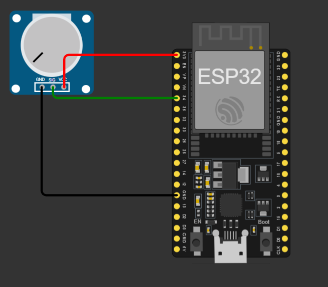

Circuito en la vida real:
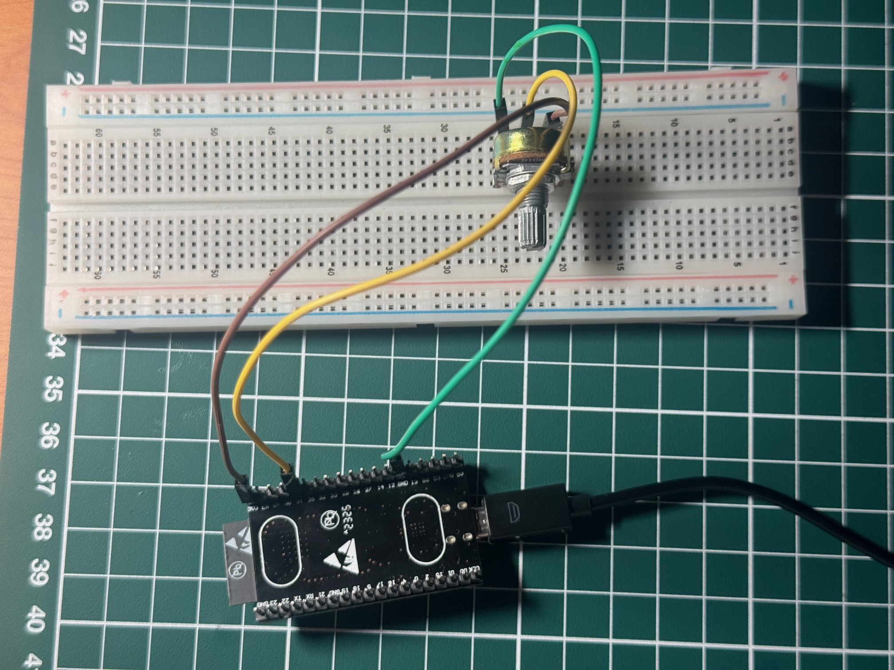

### Diagrama de Pinout
| Componente | Pin Potenciómetro | Pin ESP32 | Función |
| :--- | :--- | :--- | :--- |
| **Potenciómetro $10\text{ k}\Omega$** | VCC | 3.3V | Alimentación del divisor de voltaje |
| | SIG (Centro) | GPIO 34 | Entrada analógica (ADC1) |
| | GND | GND | Tierra común |

---

## 3. Código Implementado
Código fuente cargado en el ESP32 para realizar la adquisición de datos y la conversión de unidades:
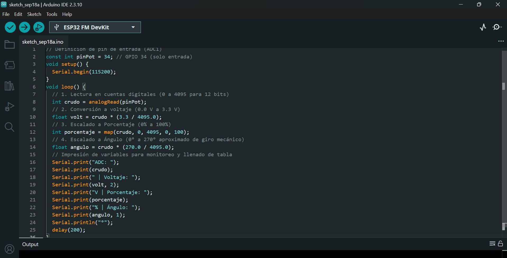

## 4. Tabla de Datos Experimentales
Se registraron las lecturas tomadas directamente del Monitor Serial situando la perilla del potenciómetro en 5 puntos de referencia mecánicos junto con la relación entre el ángulo de referencia estimado y la lectura obtenida por el ADC de 12 bits del ESP32:
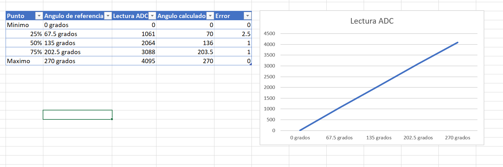

## 6. Observaciones y Bitácora del ADC
Comportamiento en los extremos: En $0^\circ$ y $270^\circ$, la respuesta digital alcanza perfectamente los límites de $0$ y $4095$ cuentas respectivamente.Evaluación de Linealidad: Aunque la gráfica muestra una tendencia marcadamente lineal, existe una ligera desviación en el rango intermedio ($25\%$), donde se registró el error máximo de $2.5^\circ$. Esto demuestra que el periférico ADC integrado en el ESP32 presenta ciertas no linealidades inherentes causadas por la atenuación interna de la tarjeta de desarrollo, separándose levemente del modelo teórico ideal.

---

## 1. Descripción de la Actividad
En esta sección se realizó la adquisición de señales provenientes de un sensor analógico de temperatura. Debido a que las lecturas del conversor ADC del ESP32 presentan ruido eléctrico y fluctuaciones indeseadas, se implementó un algoritmo de **Filtro de Promedio Móvil** con un buffer circular de $N = 10$ muestras. Este algoritmo atenúa los picos de ruido y entrega una medición suave y estable en grados Celsius ($^\circ\text{C}$).

---

## 2. Esquemático de Conexión
El pin de salida de señal del sensor de temperatura se conectó al **GPIO 35** (perteneciente al bloque **ADC1** del ESP32) para asegurar lecturas estables sin interferencias con las funciones de conectividad inalámbrica.

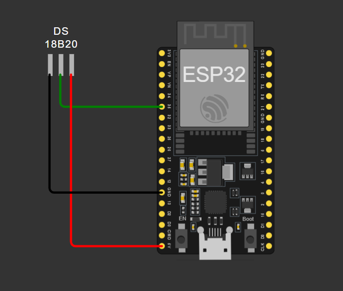

Circuito en la vida real:
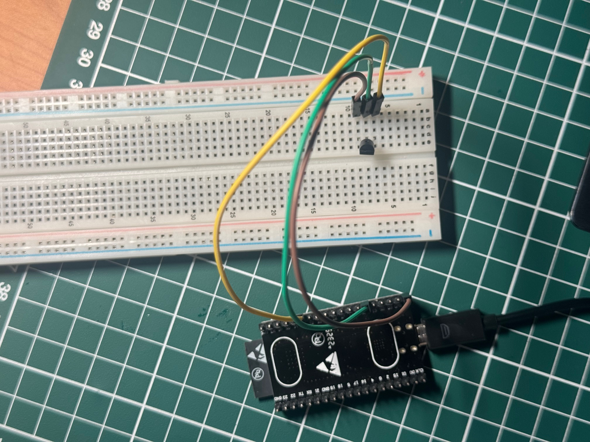

### Diagrama de Pinout
| Componente | Pin Sensor | Pin ESP32 | Función |
| :--- | :--- | :--- | :--- |
| **Sensor de Temperatura** | VCC | 3.3V | Alimentación del sensor |
| | VOUT / Signal | GPIO 35 | Entrada analógica (ADC1) |
| | GND | GND | Tierra común |

---

## 3. Código Implementado
Código en C++ cargado en el ESP32 que realiza la conversión de ADC a voltaje, el cálculo de temperatura y la aplicación del filtro de promedio móvil:
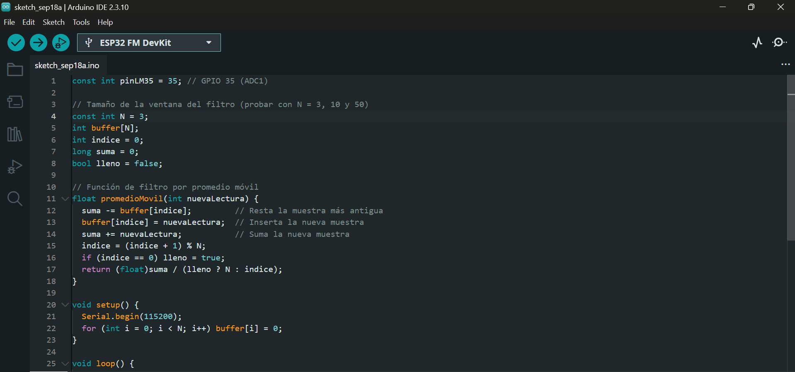
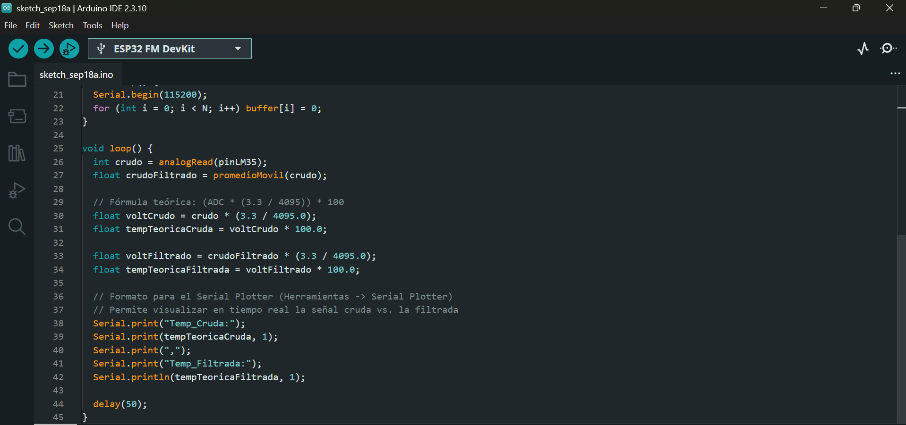

## 4. Tabla de Datos Experimentales
Se tomaron lecturas instantáneas y filtradas bajo difrenetes condiciones térmicas diferentes para evaluar el desempeño de la atenuación de ruido:
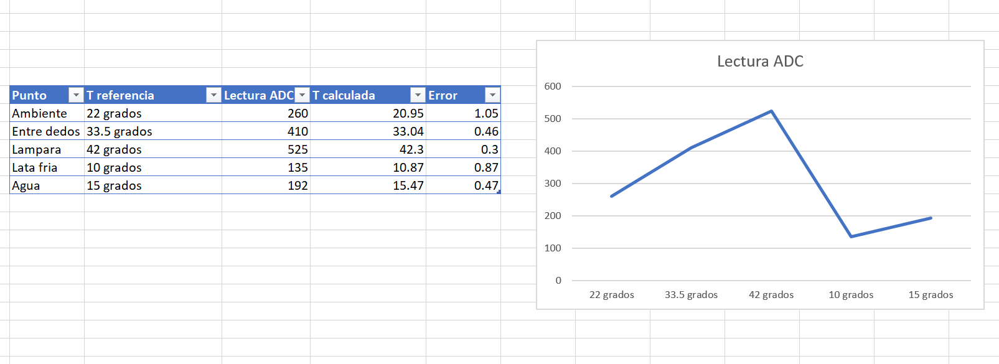

## 5. Gráfica Comparativa: 
Señal Cruda vs. FiltradaLa siguiente imagen (obtenida mediante el Serial Plotter / Excel) muestra el efecto de suavizado del filtro de promedio móvil respecto a los picos de ruido bruscos de la señal cruda:

Señal cuando N=3:

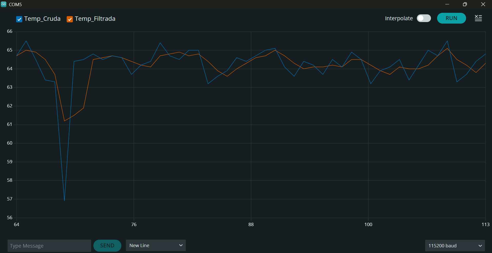

Señal cuando N=10:
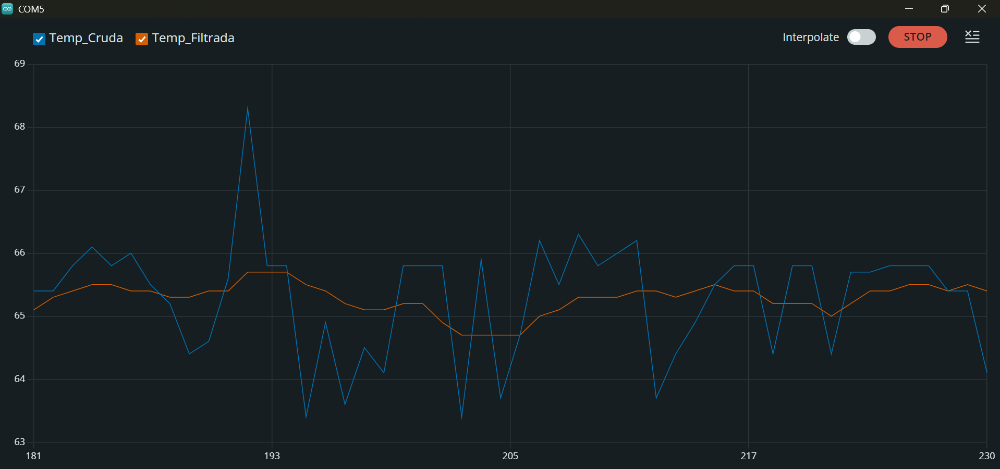

Señal cuando N=50:
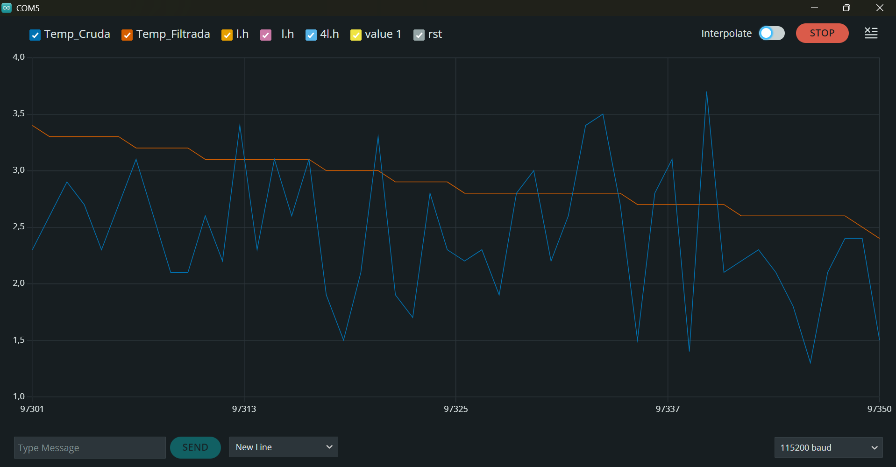

#### Justificación de la elección de $N = 10$:
* **Atenuación del ruido:** Un valor de $N = 10$ en el filtro de promedio móvil permite promediar una ventana de $100\text{ ms}$ (con un tiempo de muestreo de $10\text{ ms}$). Esto elimina eficazmente los picos de ruido electromagnético de alta frecuencia producidos por el multiplexor interno del ADC y la fluctuación de la fuente.
* **Tiempo de respuesta:** Si aumentáramos el valor a $N = 50$ o $N = 100$, aunque la señal se vería más suave, introduciría un retardo (*delay*) significativo en la medición. Esto impediría detectar cambios térmicos o de inclinación rápidos en tiempo real dentro del vehículo.
* **Uso de memoria:** Un buffer circular de $N = 10$ elementos consumirá poca memoria RAM en el microcontrolador, optimizando el rendimiento general del sistema.

## 6. Observaciones y Bitácora del Filtrado
Eliminación de ruido de alta frecuencia: La señal cruda del sensor presenta fluctuaciones rápidas debido a la atenuación del ADC del ESP32 y la interferencia electromagnética. La señal filtrada elimina estas oscilaciones sin perder la tendencia real de la temperatura.Tiempo de respuesta vs. Suavizado: Al utilizar un tamaño de ventana $N = 10$, se logra un excelente equilibrio entre estabilidad y velocidad de respuesta. Aumentar el valor de $N$ agregaría un retardo perceptible al detectar cambios rápidos de temperatura.

---

## 1. Descripción de la Actividad
En esta sección se implementó la lectura de un acelerómetro analógico de 3 ejes (X, Y, Z) para determinar la orientación en el espacio mediante los ángulos de **Roll** (rotación sobre el eje longitudinal) y **Pitch** (rotación sobre el eje lateral). Adicionalmente, se calculó la magnitud vectorial de la aceleración total para detectar picos dinámicos causados por golpes o impactos en la estructura, aplicando un umbral configurable para evitar falsas alarmas.

---

## 2. Esquemático de Conexión
Las salidas analógicas de los tres ejes del módulo se conectaron a los pines del bloque **ADC1** del ESP32 para realizar las lecturas de voltaje.
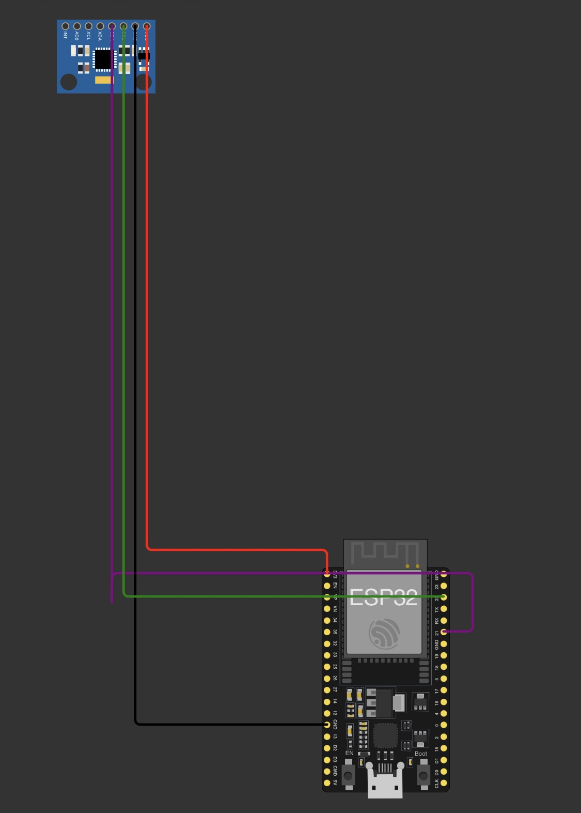
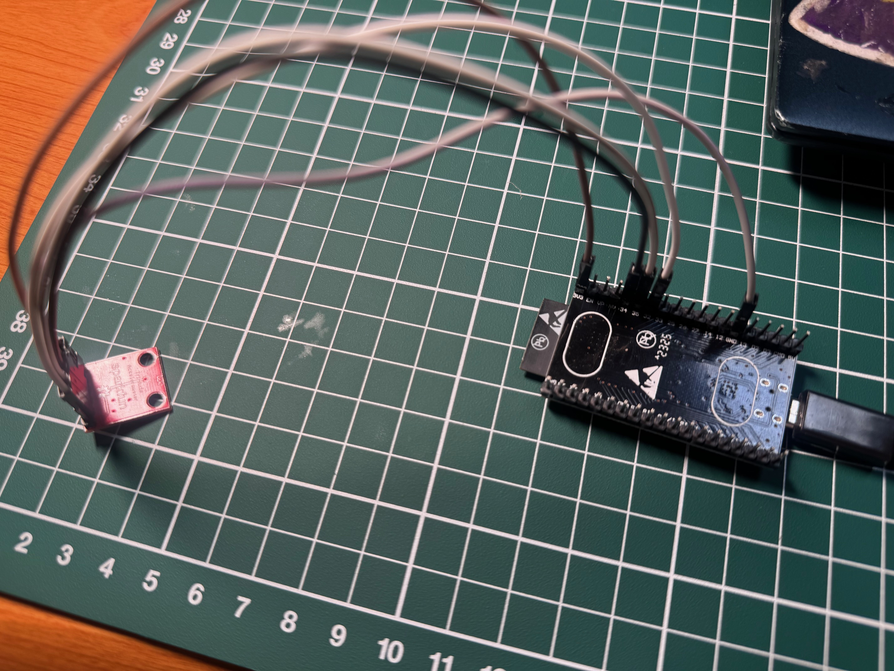

### Diagrama de Pinout
| Componente | Pin Módulo | Pin ESP32 | Función |
| :--- | :--- | :--- | :--- |
| **Acelerómetro Analógico** | VCC | 3.3V | Alimentación del sensor |
| | GND | GND | Tierra común |
| | X | GPIO 34 | Lectura analógica eje X (ADC1) |
| | Y | GPIO 35 | Lectura analógica eje Y (ADC1) |
| | Z | GPIO 32 | Lectura analógica eje Z (ADC1) |
| | ST | Sin conectar | Autoprueba (*Self-Test*) |

---

## 3. Código Implementado
Código fuente en C++ para realizar la lectura analógica de los tres ejes, la conversión a fuerza g ($g$), el cálculo trigonométrico de **Roll** y **Pitch**, y la magnitud para detección de impacto:
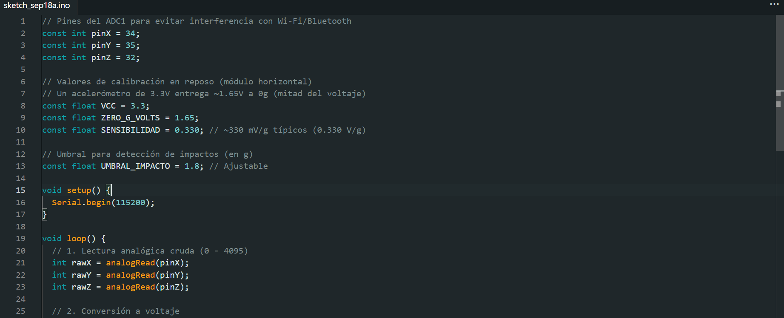
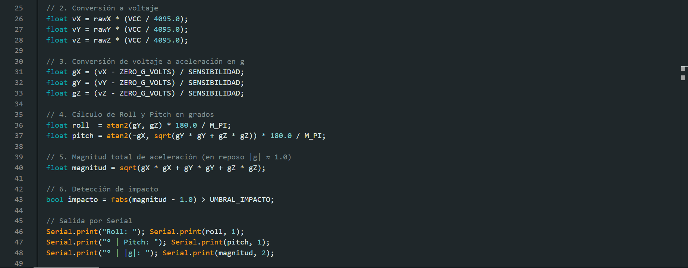

## 4. Tabla de Datos Experimentales
Se validaron los ángulos medidos por el acelerómetro contrastándolos contra la aplicación de nivelación del teléfono celular en 3 posiciones distintas:

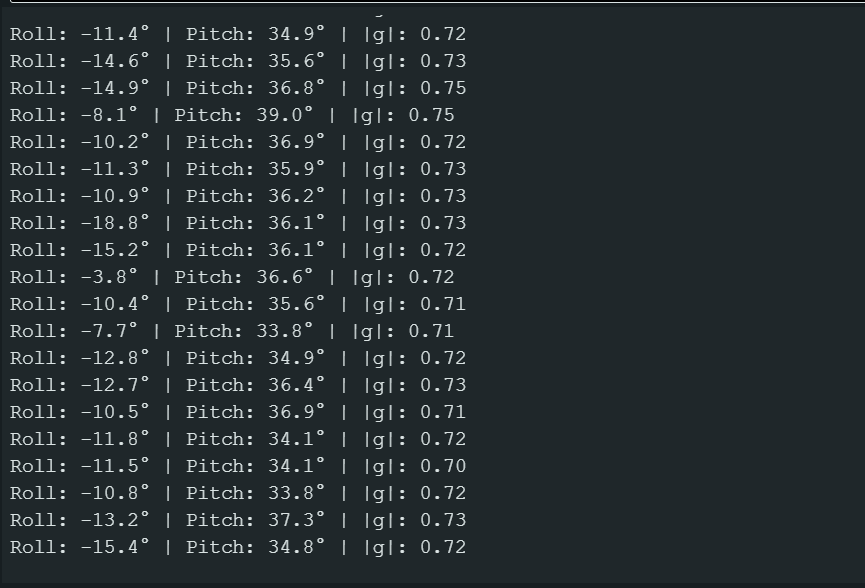
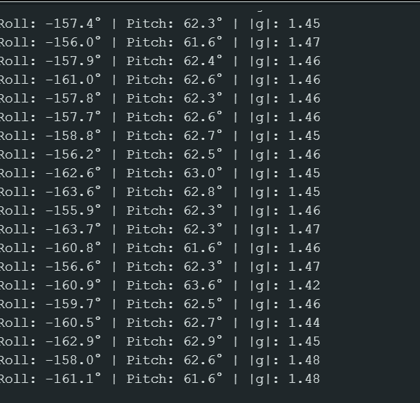

## 5. Detección de Impactos y Ajuste de Umbral
Se realizaron pruebas mecánicas aplicando pequeñas perturbaciones y golpes sobre la superficie de trabajo para evaluar la respuesta de la magnitud escalar ($\vert{}g\vert{}$)
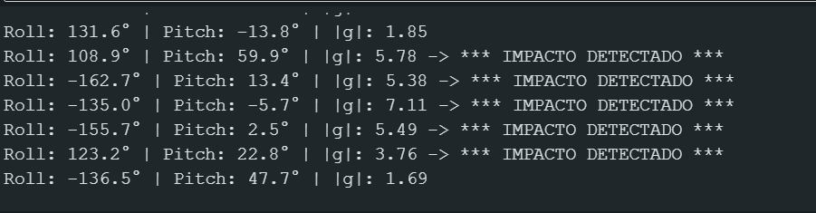

## 6. Observaciones y Bitácora del Acelerómetro
Calibración del punto cero ($0g$): Debido a las tolerancias de fabricación del sensor analógico y las variaciones de la fuente de $3.3\text{ V}$, se observó un pequeño nivel de offset (desvío) en reposo que se corrigió mediante la constante ZERO_G_VOLTS.Detección de Golpes vs. Inclinación: La magnitud escalar de aceleración permanece estable cerca de $1.0g$ durante rotaciones lentas (inclinación puramente gravitatoria). Al aplicar un golpe mecánico seco, los picos de aceleración inercial superaron el umbral de $1.8g$, permitiendo detectar choques de manera efectiva y sin falsas alarmas provocadas por el movimiento continuo del vehículo.

### 7. Bitácora de Laboratorio: Análisis y Problemas Encontrados

#### ¿El ADC es tan lineal como prometía la fórmula teórica?
**No.** Teóricamente, un ADC de 12 bits bajo la ecuación $V = \text{ADC} \times \left(\frac{3.3}{4095}\right)$ debería presentar una respuesta totalmente recta (lineal). Sin embargo, en la práctica con el ESP32 se observó lo siguiente:
1. **Zonas muertas en los extremos (*Non-linearity*):** El ADC del ESP32 presenta no-linealidad en los extremos inferior (cerca de $0\text{ V}$) y superior (cerca de $3.3\text{ V}$), donde las lecturas se saturan antes de alcanzar el valor límite mecánico.
2. **Desviación en rango medio:** Durante las mediciones del potenciómetro al $25\%$ del recorrido, se obtuvo un error de $2.5^\circ$, comprobando la presencia de una ligera curva de atenuación en los atenuadores internos del canal ADC.

*Se usó Claude para la elaboracion del codigo en Visual Studio y formato de la practica*