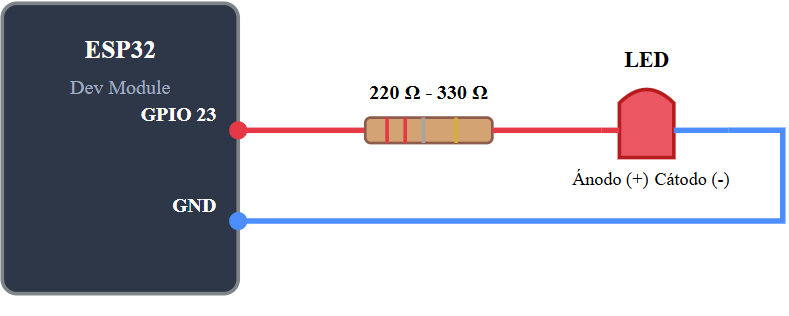
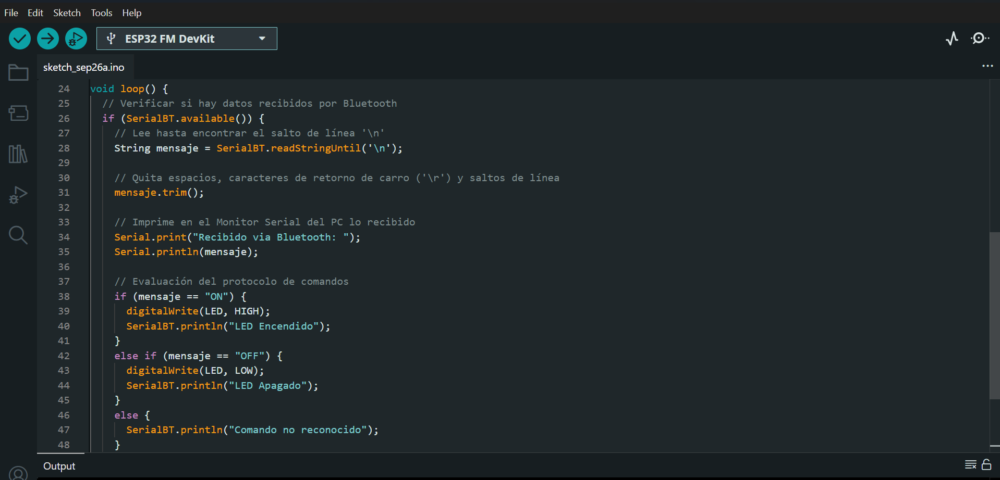
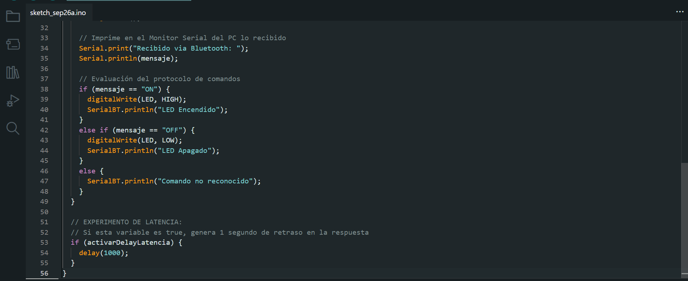
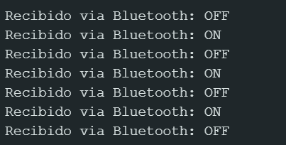
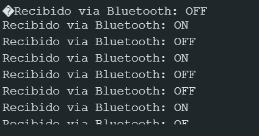

# Reporte de Práctica: Comunicación Bluetooth con ESP32

## 1. Objetivos de la Práctica
- **Enlace Bluetooth:** Establecer una conexión serial inalámbrica mediante `BluetoothSerial.h`, verificando el emparejamiento con el dispositivo móvil y la recepción de datos en el Monitor Serial.
- **Control de LED mediante Bluetooth:** Implementar el control de encendido y apagado de un LED con los comandos `ON` y `OFF` usando limpieza de cadenas (`mensaje.trim()`).
- **Protocolo de Comandos:** Documentar la estructura y relación entre comando y acción recibida por el microcontrolador.
- **Experimento de Latencia:** Comparar el comportamiento del sistema de control con y sin retardos bloqueantes (`delay(1000)`).

---

## 2. Diagrama de Conexión
A continuación se ilustra la conexión del circuito físico entre la tarjeta ESP32, la resistencia limitadora de corriente (220 Ω - 330 Ω) y el LED.



---

## 3. Código Implementado
El desarrollo del firmware en C++ para el ESP32 se estructuró en tres partes principales para facilitar su lectura y depuración:

### Captura 1: Configuración inicial e inclusión de librerías


```cpp
#include "BluetoothSerial.h"

BluetoothSerial SerialBT;

// Definición de pines (puedes usar el LED incorporado GPIO 2 o cambiarlo al pin que gustes)
#define LED 2

// Cambia a true si quieres probar el Experimento de Latencia (delay a propósito)
bool activarDelayLatencia = false;

void setup() {
  Serial.begin(115200);

  // Inicialización del Bluetooth con el nombre del dispositivo
  SerialBT.begin("ESP32_Practica"); // Nombre visible en el celular
  SerialBT.setTimeout(20);         // Evita que readStringUntil bloquee el loop

  pinMode(LED, OUTPUT);
  digitalWrite(LED, LOW);

  Serial.println("Servicio Bluetooth listo. Empareja tu celular con 'ESP32_Practica'.");
}
```

### Captura 2: Recepción de comandos y limpieza de cadenas con `trim()`


```cpp
void loop() {
  // Verificar si hay datos recibidos por Bluetooth
  if (SerialBT.available()) {
    // Lee hasta encontrar el salto de línea '\n'
    String mensaje = SerialBT.readStringUntil('\n');

    // Quita espacios, caracteres de retorno de carro ('\r') y saltos de línea
    mensaje.trim();

    // Imprime en el Monitor Serial del PC lo recibido
    Serial.print("Recibido via Bluetooth: ");
    Serial.println(mensaje);

    // Evaluación del protocolo de comandos
    if (mensaje == "ON") {
      digitalWrite(LED, HIGH);
      SerialBT.println("LED Encendido");
    }
    else if (mensaje == "OFF") {
      digitalWrite(LED, LOW);
      SerialBT.println("LED Apagado");
    }
    else {
      SerialBT.println("Comando no reconocido");
    }
  }
```

### Captura 3: Estructura del experimento de latencia


```cpp
  // EXPERIMENTO DE LATENCIA:
  // Si esta variable es true, genera 1 segundo de retraso en la respuesta
  if (activarDelayLatencia) {
    delay(1000);
  }
}
```

---

## 4. Tabla del Protocolo de Comandos

| Comando Enviado | Acción Realizada | Respuesta por Bluetooth |
| :--- | :--- | :--- |
| `ON` | Enciende el LED | `"LED Encendido"` |
| `OFF` | Apaga el LED | `"LED Apagado"` |
| *Cualquier otro* | Ninguna | `"Comando no reconocido"` |

---

## 5. Demostración y Experimento de Latencia

### Funcionamiento sin retraso (`activarDelayLatencia = false`)
En esta prueba, el bucle `loop()` se ejecuta sin interrupciones. El tiempo de respuesta entre el envío del comando desde el dispositivo móvil y la respuesta del LED es instantáneo.

[](https://www.youtube.com/watch?v=w9_F6HntLNY "Ver video: LED Bluetooth sin delay")

Señal y datos recibidos:


### Funcionamiento con latencia inducida (`activarDelayLatencia = true`)
Al introducir la función `delay(1000)`, la ejecución del programa se bloquea durante 1 segundo por ciclo. Esto ocasiona que los comandos enviados se acumulen en el búfer serial, generando un retraso significativo entre la orden enviada y la reacción del LED.

[](https://www.youtube.com/watch?v=xdn0YzC4I3Y "Ver video: LED Bluetooth con delay")

Señal y datos recibidos:

---

## 6. Conclusión
1. **Importancia de `trim()`:** La limpieza de la cadena mediante `mensaje.trim()` resulta esencial. Sin este paso, caracteres invisibles de fin de línea como `\r` o `\n` impiden que las comparaciones estricta (`mensaje == "ON"`) sean afirmativas.
2. **Impacto de funciones bloqueantes:** La prueba de latencia demostró que el uso de `delay()` degrada drásticamente la capacidad de respuesta en tiempo real del ESP32. Para aplicaciones de control crítico (como carritos a control remoto o sistemas de seguridad), el hilo principal de ejecución debe permanecer libre de bloqueos.